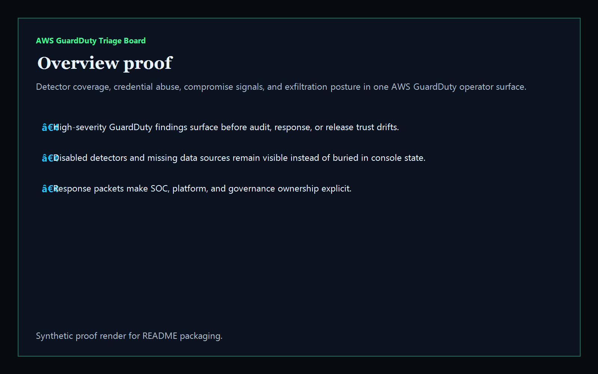
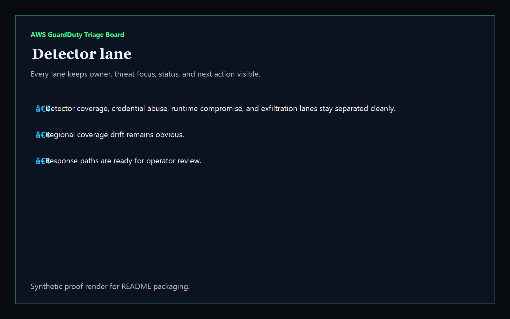
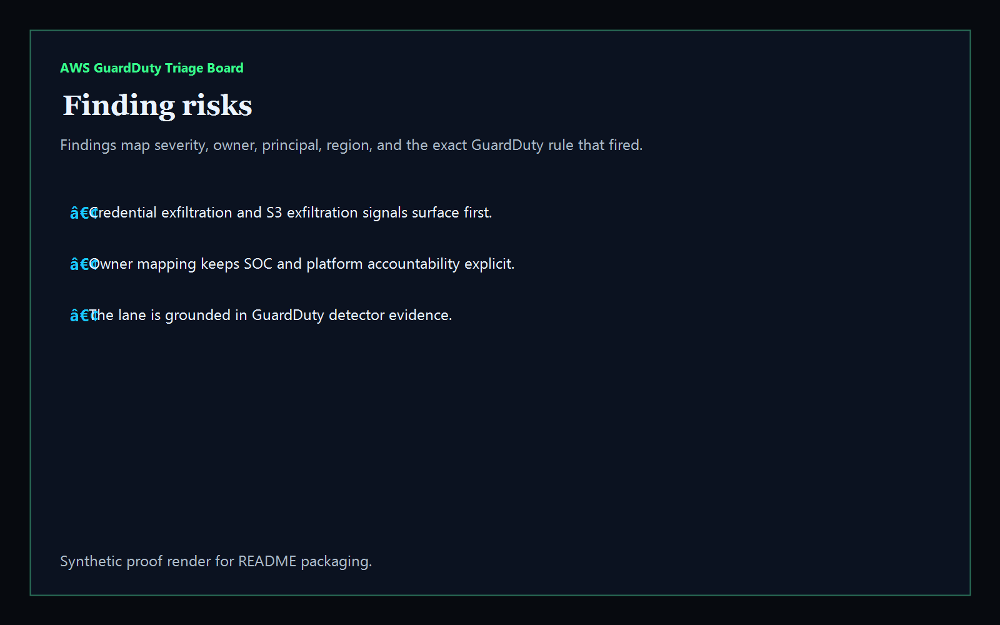
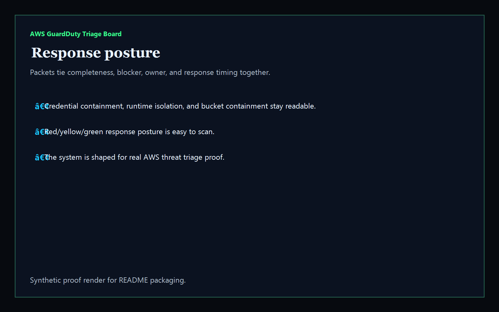

# aws-guardduty-triage-board

[](https://github.com/mizcausevic-dev/aws-guardduty-triage-board/actions/workflows/ci.yml)
[](./LICENSE)
[](https://github.com/mizcausevic-dev/aws-guardduty-triage-board/actions/workflows/pages.yml)

Operator control plane for AWS GuardDuty detectors, threat findings, credential abuse, runtime compromise, exfiltration signals, and response sequencing.

## Why this exists

- GuardDuty exports become dangerous when they stay trapped in raw JSON instead of one operator-readable surface.
- Detector coverage, credential abuse, runtime compromise, and exfiltration posture need to stay visible together before incidents, audits, or release windows drift.
- Recruiters looking for `AWS / GuardDuty / incident response / cloud security` proof should see a real threat-operations dashboard, not a keyword page.
- This repo turns GuardDuty data into a control plane for detector gaps, high-severity findings, stale triage, and response packet sequencing.

## Why this matters (KG Embedded tie-back)

This repo demonstrates the AWS managed-threat-detection control-plane primitive for cloud operations: detector health, compromise findings, exfiltration posture, and remediation packets in one operator surface. Kinetic Gain Embedded extends this pattern into productized in-app dashboards where platform, SOC, and security teams need evidence-rich surfaces without exposing raw admin backends or cloud credentials. See [kineticgain.com/embedded](https://kineticgain.com/embedded).

## What it shows

- `detector-lane` visibility for active and disabled detectors, data-source coverage, and response ownership in one dashboard
- `finding-risks` detection for credential exfiltration, crypto-mining/runtime compromise, anomalous API behavior, and S3 exfiltration posture
- response packets for detector restoration, credential containment, workload isolation, and finance-bucket containment
- offline-safe analysis of captured AWS GuardDuty exports
- recruiter-facing AWS threat-detection / incident-response proof that complements the Microsoft, GCP, and broader cloud-admin lanes

## Routes

- `/`
- `/detector-lane`
- `/finding-risks`
- `/response-posture`
- `/verification`
- `/docs`

## API

- `/api/dashboard/summary`
- `/api/detector-lane`
- `/api/finding-risks`
- `/api/response-posture`
- `/api/verification`
- `/api/sample`

## Screenshots






## CLI

```powershell
npx aws-guardduty-triage fixtures/guardduty.json `
    --format json|markdown|summary `
    --now 2026-05-30T00:00:00Z `
    --stale-finding-after-hours 48 `
    --fail-on-high `
    --out report.md
```

Input shape:

```json
{
  "detectors": [ ... ],
  "findings": [ ... ]
}
```

## Local Development

```powershell
cd aws-guardduty-triage-board
npm install
npm run dev
```

Open:
- [http://127.0.0.1:5520/](http://127.0.0.1:5520/)
- [http://127.0.0.1:5520/detector-lane](http://127.0.0.1:5520/detector-lane)
- [http://127.0.0.1:5520/finding-risks](http://127.0.0.1:5520/finding-risks)
- [http://127.0.0.1:5520/response-posture](http://127.0.0.1:5520/response-posture)
- [http://127.0.0.1:5520/verification](http://127.0.0.1:5520/verification)

## Validation

- `npm run lint`
- `npm run typecheck`
- `npm run coverage`
- `npm run build`
- `npm run demo`
- `npm run smoke`
- `npm run prerender`
- `npm run render:assets`

## Production status

| Aspect | Status |
|--------|--------|
| CI | Node 20 + 22 matrix — lint · typecheck · coverage · build · demo · smoke · prerender · `npm audit` |
| License | [AGPL-3.0-or-later](./LICENSE) |
| Deploy | Static prerender -> **https://guardduty.kineticgain.com/** |
| Data posture | Synthetic sample data only; no live AWS credentials, account tokens, or production GuardDuty exports |

## Docs

- [Kinetic Gain Embedded tie-back](./docs/KINETIC_GAIN_EMBEDDED.md)
- [Changelog](./CHANGELOG.md)

## Composes with

- [**`entra-access-review-control-plane`**](https://github.com/mizcausevic-dev/entra-access-review-control-plane) — Microsoft Entra access reviews
- [**`aws-iam-access-analyzer-console`**](https://github.com/mizcausevic-dev/aws-iam-access-analyzer-console) — AWS IAM analyzer posture
- [**`gcp-iam-policy-diff-lab`**](https://github.com/mizcausevic-dev/gcp-iam-policy-diff-lab) — GCP IAM drift and guardrail posture

Together they form a broader recruiter-facing cloud admin lane: Microsoft tenant governance plus AWS identity, threat-detection, and GCP admin proof.
